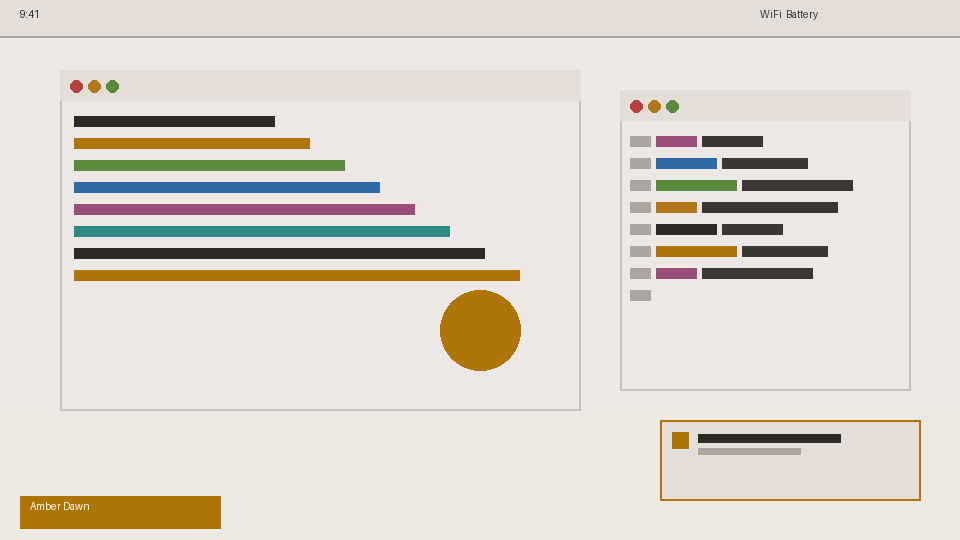

# Amber Dawn — Omarchy Theme

Warm light theme for [Omarchy](https://github.com/basecamp/omarchy) on Hyprland. Amber/gold accents on soft ivory background, with high-contrast readable terminal colors (all ANSI colors ≥ 4.5:1 WCAG AA contrast).



## Design Principles

- **Wallpaper-derived:** Colors extracted from the golden accent point in the wallpaper
- **High contrast:** foreground/background = 13.98:1 (AAA), accent/background = 4.51:1 (AA), no color below 4.5:1
- **Warm temperature:** All 16 ANSI colors follow warm tones — no pure cold hues
- **Visual hierarchy:** foreground > accent > muted > background
- **Predictable semantics:** ANSI color slots are coherent in a light theme context (black = dim, white = text)

## Color Palette

| Component       | Color         | Usage                          |
|-----------------|---------------|--------------------------------|
| Background      | `#EDE8E6`     | Main background (warm ivory)   |
| Foreground      | `#2E2A28`     | Primary text (warm brown)      |
| Cursor          | `#9A6606`     | Terminal cursor                |
| Accent          | `#B07508`     | Amber accent (borders, highlights) |
| Selection bg    | `#C4BCB6`     | Text selection background      |
| Selection fg    | `#1E1A18`     | Selected text                  |

### ANSI 16 Colors

| Slot      | Normal              | Bright              |
|-----------|---------------------|---------------------|
| Black     | `#6A6460` (dim)     | `#645C58` (dim)     |
| Red       | `#AE3C3C`           | `#C63838`           |
| Green     | `#3E6E22`           | `#3E6E20`           |
| Yellow    | `#8E6010`           | `#8E6010`           |
| Blue      | `#2E6BA6`           | `#2E6BA6`           |
| Magenta   | `#9A4E7A`           | `#9A4E7A`           |
| Cyan      | `#1E7068`           | `#1E7068`           |
| White     | `#3A3634` (text)    | `#524E4C`           |

## Installation

### Omarchy Theme

```bash
# Clone into your Omarchy themes directory
git clone https://github.com/amarqs182/amber-dawn-omarchy-theme.git ~/.config/omarchy/themes/amber-dawn

# Apply the theme
omarchy theme set amber-dawn
# Or: Super+Alt+Space → Style → Theme → amber-dawn
```

### Hermes TUI Skin

The theme includes a Hermes Agent TUI skin for light terminal backgrounds:

```bash
# Copy the skin
mkdir -p ~/.hermes/skins
cp ~/.config/omarchy/themes/amber-dawn/hermes-skin.yaml ~/.hermes/skins/amber-dawn.yaml

# Activate in ~/.hermes/config.yaml
# display.skin: amber-dawn
```

### Terminal Light Mode Detection

The Hermes TUI defaults to dark mode. To ensure light mode is detected, add to your terminal config:

**Alacritty** (`~/.config/alacritty/alacritty.toml`):
```toml
[env]
TERM = "xterm-256color"
HERMES_TUI_LIGHT = "1"
COLORFGBG = "0;15"
```

An example Alacritty config is included as `alacritty.example.toml`.

## Files

```
amber-dawn/
├── colors.toml          # Full palette (UI + 16 ANSI)
├── light.mode           # Marks theme as light mode
├── icons.theme          # Walker/menu icons
├── neovim.lua           # Neovim colors
├── vscode.json          # VS Code token colors
├── btop.theme           # btop system monitor theme
├── hermes-skin.yaml     # Hermes Agent TUI skin
├── alacritty.example.toml  # Example Alacritty config with light mode env
├── backgrounds/
│   └── amber-dawn.png   # Theme wallpaper
├── preview.png          # Preview with wallpaper
├── unlock.png           # Lock screen preview
└── preview-unlock.png   # Lock screen preview (no wallpaper)
```

## Generated Components (26+)

When `omarchy theme set amber-dawn` runs, Omarchy auto-generates configs for:

Hyprland, Alacritty, Ghostty, Kitty, Foot, Waybar, Walker, Mako, Hyprlock, SwayOSD, Chromium, Obsidian, Neovim, btop, Helix, Gum, Keyboard RGB, VS Code, and more.

## License

MIT
